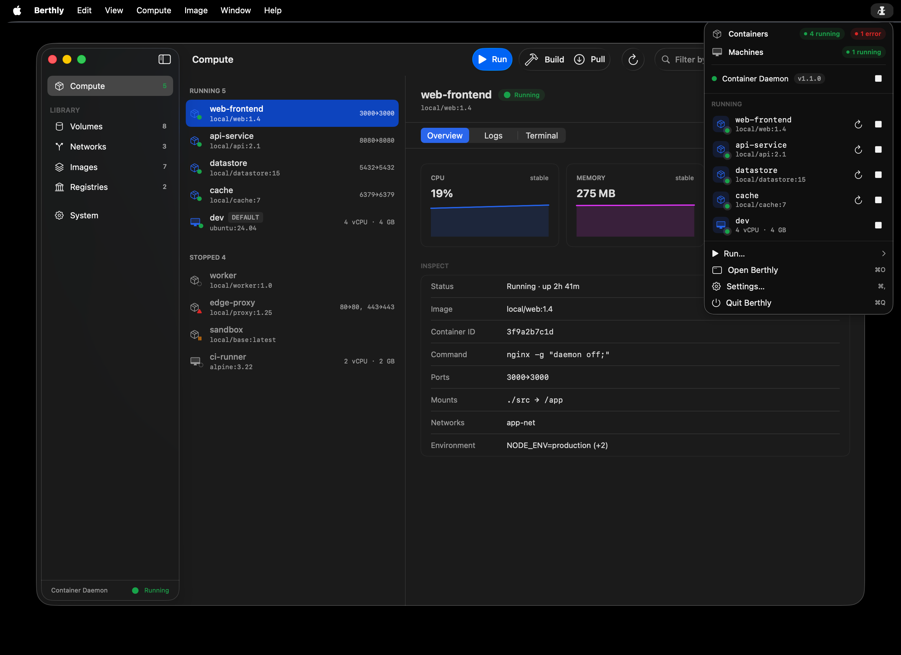
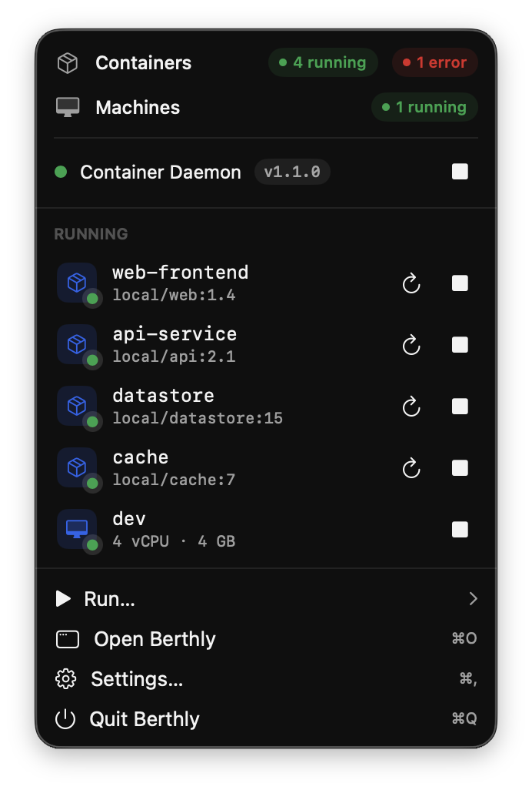

# Berthly

[](https://github.com/henrywang/Berthly/actions/workflows/ci.yml)

A native macOS app for [Apple's `container`](https://github.com/apple/container) — build images, run containers and machines, manage networks and volumes, and tail logs from a real GUI instead of the command line.

Berthly lives in your menu bar and opens a full SwiftUI window, giving Apple's container tooling the Docker Desktop-style experience it's missing.



## Features

- **Images** — list, pull from a registry, build from a Dockerfile, and inspect layers and metadata.
- **Containers** — create and run containers, view details, and stream logs live.
- **Machines** — create and manage VMs, set the kernel, and inspect resources.
- **Networks & volumes** — create, list, and remove them without touching a terminal.
- **Registries** — sign in to private registries and manage saved hosts.
- **Integrated terminal** — a real terminal attached to your containers, built on SwiftTerm.
- **Command palette** — jump to any action with a keystroke.
- **Menu-bar presence** — quick status and controls without leaving what you're doing.
- **Keyboard-first** — ⌘K palette, ⌘1–6 section switching, ⌘⌥1–3 detail tabs, and full menu shortcuts for every action.


<p align="center">
  
</p>

Berthly covers the `container` CLI's full feature surface — see [PARITY.md](PARITY.md)
for the subcommand-by-subcommand mapping and the few expert flags left to the CLI.

## Requirements

- **Apple Silicon Mac** — `container` runs Linux containers in lightweight VMs and requires Apple Silicon.
- **macOS 26 or later.**
- **[Apple's `container`](https://github.com/apple/container) installed and running.** Berthly is a GUI on top of it; it can help you install and start the daemon, but it drives the same underlying tooling.

## Building

Berthly is an Xcode project. It links against Apple's [`container`](https://github.com/apple/container) and [`containerization`](https://github.com/apple/containerization) Swift packages, resolved automatically via Swift Package Manager.

```sh
git clone https://github.com/henrywang/Berthly.git
cd Berthly
open Berthly.xcodeproj
```

Then build and run the **Berthly** scheme (⌘R). Package resolution runs on first open and may take a few minutes.

> **Note:** building the container/containerization dependencies requires the Swift toolchain that ships with the matching Xcode; make sure your Xcode is current.

## Testing

- **Unit tests** (`BerthlyTests`) use [Swift Testing](https://github.com/apple/swift-testing).
- **UI tests** (`BerthlyUITests`) use XCUITest and can run against a mock service for determinism.

```sh
xcodebuild test -scheme Berthly -destination 'platform=macOS'
```

## Privacy & security

Berthly is a local tool, and it behaves like one:

- **Everything stays on your Mac.** Berthly talks to the local `container`
  daemon over XPC. There is no telemetry, no analytics, and no crash
  reporting.
- **Network traffic is limited to what you can see.** Image pulls, pushes,
  and registry sign-ins go to the registries *you* configure — the same ones
  the `container` CLI would contact. Beyond that, Berthly contacts GitHub in
  exactly two cases: checking for Berthly updates (Sparkle fetches the
  release feed from this repo's GitHub Releases — disable it in Settings if
  you prefer), and downloading Apple's signed `container` installer when you
  use the guided install/upgrade flow.
- **Registry credentials live in your macOS Keychain**, in the very same
  Keychain items `container registry login` uses. Berthly never stores
  credentials anywhere else.
- **Not sandboxed, by necessity.** Berthly manages the container daemon
  (XPC, `launchctl`) and works with your local files for builds and volume
  mounts — capabilities the App Sandbox doesn't allow. The code is open;
  audit what it does.

Found a vulnerability? Please report it privately — see
[SECURITY.md](SECURITY.md).

## Contributing

Contributions are welcome! See [CONTRIBUTING.md](CONTRIBUTING.md) for how to
build, test, and submit changes. Bug reports and feature requests are welcome
via [issues](https://github.com/henrywang/Berthly/issues).

## License

Licensed under the [Apache License 2.0](LICENSE).
